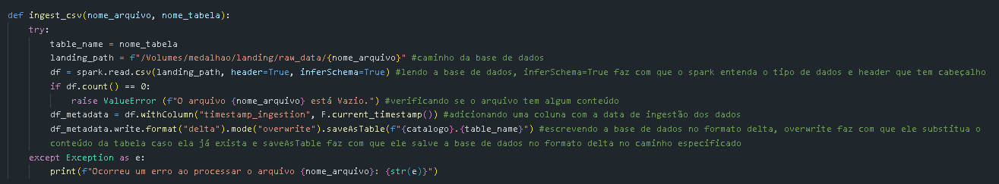
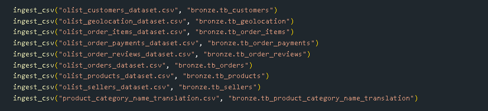

# Engenharia-de-Dados
Atividade de Engenharia de Dados Rocket Lab: Estruturar dados de um grande E-commerce.

A funcão "ingest_csv" é responsavel por ler os dados do ".csv" e salva como tabela Delta na camada Bronze, além de adicionar a coluna "timestamp_ingestion" que informa a data da ingestão dos dados.

A função "ingest_csv" é chamada alterando o nome de cada tabela de acordo com o mapeamento desejado.

